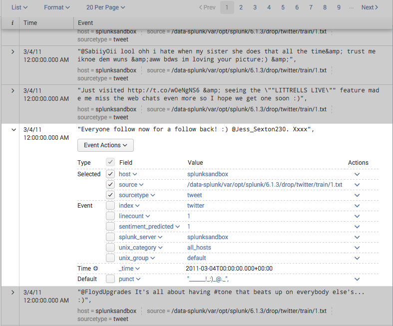
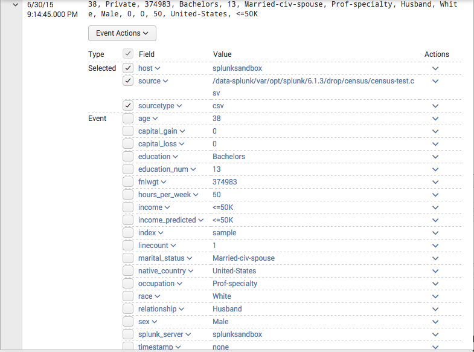
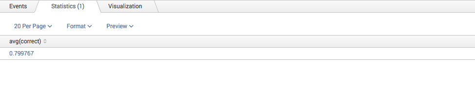
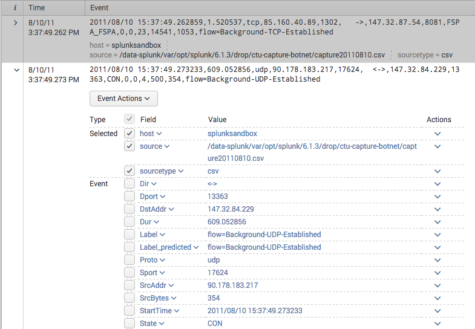

.. SplunkML Documentation file

.. _splunkml-mcpredict:

mcpredict
================================================

Contents
------------------------------------------------

.. toctree::

  mcpredict

Synopsis
------------------------------------------------

Use a multiclass/binary classifier trained using ``mctrain`` to predict values in a event stream. Like ``mctrain``, this command uses the Logistic Regression [2]_ implementation in SciKit-Learn [1]_.

Syntax
````````````````````````````````````````````````

::
  mcpredict model=<model-name>

Arguments
````````````````````````````````````````````````

model
  **Syntax**: ``<string>``

  **Description**: Name of your model, which corresponds to the filename for the model stored on disk. By default, the models are stored in ``$SPLUNK_HOME/etc/apps/splunkml/local/classifiers``. Each model can be several files, this is for optimal memory usage and performance when loading and saving models.


Description
------------------------------------------------

The ``mcpredict`` command is used to predict values based on a multiclass classifier trained using ``mctrain``.

When you run ``mcpredict`` on an event stream, it will use information from the training operation, such as the field values that were used for training, the target field, and the text model (if any) in order to predict the value of the target field in the event stream.  It will set this value in a new field called ``<target-field-name>_predicted``.


Examples
------------------------------------------------

.. _mcpredict-twitter-sentiment:

Example 1
````````````````````````````````````````````````

  *For* ``mctrain`` *example for training the* ``twitter_sentiment`` *model, click* `here <mctrain.rst#example-1>`_.

Using twitter sentiment data from the Sentiment Analysis app [3]_, predict the sentiment value for a set of tweets.  We'll use ``tail`` to get untrained data from end of the dataset.

  index=twitter |tail 300 | mcpredict model=twitter_sentiment 

Here's a snapshot of the results:



Note the ``sentiment_predicted`` field in each event in the resulting event stream.

.. _mcpredict-census-income:

Example 2
````````````````````````````````````````````````

 *For* ``mctrain`` *example for training the* ``census_income`` *model, click* `here <mctrain.rst#example-2>`_.

Using census data from UCI repository [4]_, predict income level greater or lower than $50K. This dataset comes with presplit *training* and *test* data, so we operate on the *test* source.::

  index=sample source="*census-test*" | mcpredict model=census_income

Here's a snapshot of the results:



Here's a method for computing the mean accuracy over the test set.::

  index=sample source="*census-test*" | fields age, workclass, fnlwgt, education, education_num, marital_status, occupation, arming_fishing, relationship, race, sex, capital_gain, capital_loss, hours_per_week, native_country, income | mcpredict model=census_income | eval correct=if(income == income_predicted, 1, 0) | stats avg(correct)



.. _mcpredict-botnet-traffic:

Example 3
````````````````````````````````````````````````

  *For* ``mctrain`` *example for training the* ``botnet_traffic`` *model, click* `here <mctrain.rst#example-3>`_.

Using labeled botnet traffic from the CTU-13 Dataset [5]_, label traffic type, whether botnet or other type of application traffic.  We'll use data we didn't train on before, so we use the ``tail`` command in search for other data.::

  index=sample source="*ctu*" | tail 300 | mcpredict model="botnet_traffic"
  
Here's a snapshot of the results:




References
------------------------------------------------

.. [1] Scikit-learn: Machine Learning in Python, Pedregosa et al., JMLR 12, pp. 2825-2830, 2011, `<http://jmlr.csail.mit.edu/papers/v12/pedregosa11a.html>`_

.. [2] Logistic Regression, Scikit-Learn `<http://scikit-learn.org/stable/modules/generated/sklearn.linear_model.LogisticRegression.html>`_

.. [3] Sentiment Analysis, SplunkBase, `<https://splunkbase.splunk.com/app/1179/>`_

.. [4] UCI Machine Learning Repository; Lichman, M.; 2013; Irvine, CA; University of California, School of Information and Computer Science; `<http://archive.ics.uci.edu/ml>`_

.. [5] The CTU-13 Dataset: A Labeled Dataset with Botnet, Normal and Background Traffic, Malware Capture Facility Project, `<http://mcfp.weebly.com/the-ctu-13-dataset-a-labeled-dataset-with-botnet-normal-and-background-traffic.html>`_