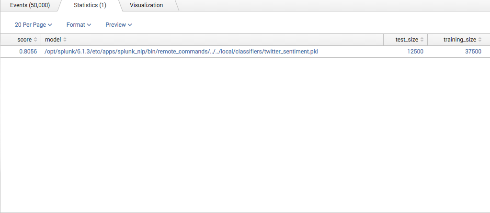
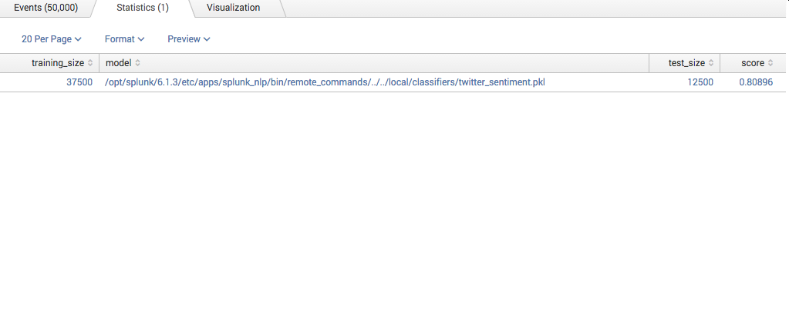
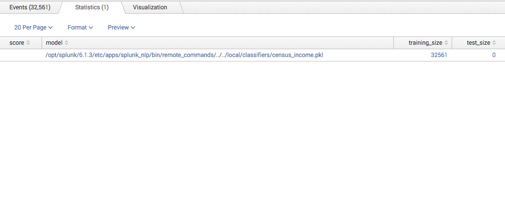
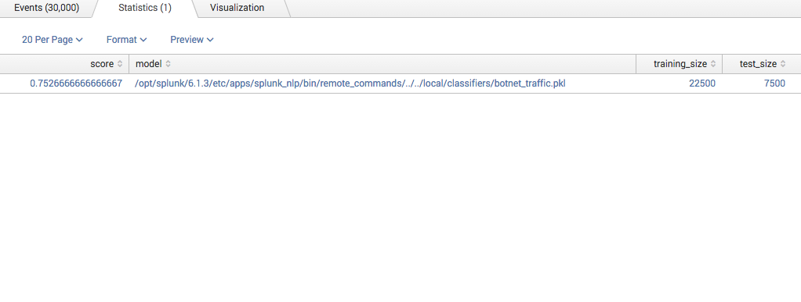

.. SplunkML Documentation file

.. _splunkml-mctrain:

mctrain
================================================

Contents
------------------------------------------------

.. contents:: :local:

Synopsis
------------------------------------------------

Train a multiclass/binary classifier using logistic regresssion.  This command uses the Logistic Regression [2]_ implementation in SciKit-Learn [1]_.

Syntax
````````````````````````````````````````````````

::

  mctrain model=<model-name> target=<field-name> [reset=bool] [textmodel=(hashing|lsi|tfidf)] [test_size=num] [_C=num] [num_fields=<field-list>] [str_fields=<field-list>]  <field-list>


Arguments
````````````````````````````````````````````````

model
  **Syntax**: ``<string>``

  **Description**: Name of your model, which corresponds to the base filename for the model stored on disk. By default, the models are stored in ``$SPLUNK_HOME/etc/apps/splunkml/local/classifiers``. Each model can be several files, this is for optimal memory usage and performance when loading and saving models.

target
  **Syntax**: ``<field-name>``

  **Description**: Name of the field that your model will try to predict.  This field must have a discrete set of values to choose.

reset
  **Syntax**: ``<bool>``

  **Description**: Delete the existing (if any) model on disk, and train a new model with the same name using the data in the current event stream

textmodel
  **Syntax**: ``hashing | lsi | tfidf``

  **Default**: ``hashing``

  **Description**: When creating features from text fields, this option chooses the appropriate model to use when mapping the text corpus data. The default is to use the "hashing trick" [3]_, a fast and space-efficient way of vectorizing features.  The ``lsi`` option utilizes Latent Semantic Indexing [4]_ and ``tfidf`` utilizes Term Frequency: Inverse Document Frequency [5]_.

test_size
  **Syntax**: <num>

  **Default**: ``0.25``

  **Description**: By default, the corpus dataset derived from the event stream is split into a training and test set in order to cross validate the model. If the ``test_size`` is a float between ``0.0`` and ``1.0``, it represents the proportion of the corpus dataset to include in the test split. If ``test_size`` is an integer, it represents the absolute number of test samples. Set to ``0`` to avoid the testing stage of the algorithm altogether.  

_C
  **Syntax**: ``<num>``

  **Default**: ``1.0``

  **Description**: Inverse of the regularization strength, must be ``> 0.0``. Smaller values specify stronger regularization.

field-list
  **Syntax**: ``<string>, ...``

  **Default**: ``_raw``

  **Description**:  One field or a list of field names to construct feature vectors. If the fields are numeric, the numbers define a vector for the outlier calculation. If the fields are not numeric, the command will convert the concatenated text of fields to a vector using the ``textmodel``. When there are both numeric and text fields to train on, the feature vectors derived from numeric fields and text fields are concatenated together.  The default is to convert the text in the ``_raw`` event field into a vector.

num_fields
  **Syntax**: ``<string>, ...``

  **Default**: ``<empty>``

  **Description**: Usually the command will automatically try to determine whether the field is numeric or a string.  Fields listed here will automatically be converted to numberic values. If the conversion can't be made, the value will default to ``0``.

str_fields
  **Syntax**: ``<string>, ...``

  **Default**: ``<empty>``

  **Description**: Like ``num_fields``, except fields listed here will automatically be treated as strings. This means they will be concatenated with other text fields, and the ``textmodel`` will be used to determine the feature vector representation.


Description
------------------------------------------------

The ``mctrain`` command uses Logistic Regression to train a multiclass classifier.  

This command first will read the event stream and create a feature vector for each event.  It concatenates all text-based fields together to form a sentence, and uses the specified ``textmodel`` to create a feature vector. If there are fields with numeric values specified, it will use those values to build the feature vector. If a combination of text-valued and numeric-valued fields are specified, it will concatenate the text and numeric vectors together for the feature vector.  Using the vectors along with ``target`` field values (which either must be a binary or a discrete-valued field), it will (if specified) split the dataset into training and test subsets.  It will train the algorithm using the training set, and then test the trained model on the test set.  It will then return a summary with the mean accuracy of the test, the size of the training and test subsets, and the path to the model file.


Examples
------------------------------------------------

.. _mctrain-twitter-sentiment:

Example 1
````````````````````````````````````````````````

Using twitter data from the Sentiment Analysis app [6]_, train a classifier that can classify sentiment on tweets.  First, import the data into Splunk by dropping both files into a directory and adding that directory via the Data Inputs configuration console.  For this example, we will convert the file name to the target field that we want to use in our model using the ``rex`` command.::

  index=twitter | rex field=source ".+\/(?<sentiment>-?1)\.txt"  | head 50000 | mctrain target=sentiment model=twitter_sentiment 

Note the use of ``head`` here; this is based on the maximum number of records that can be processed.  This value can be changed in ``inputs.conf`` in your Splunk installation.  Here's a snapshot of the results:



This model is trained on the data in ``_raw`` field which essential the bulk string of the whole event. 

Alternatively, we can also train the model using another text modeling algorithm instead of the standard "hashing" trick [3]_. Here, we'll use TF-IDF [5]_.  Note the use of ``reset=t`` to delete the original classifier in order to retrain from scratch::

  index=twitter | rex field=source ".+\/(?<sentiment>-?1)\.txt"  | head 50000 | mctrain reset=t textmodel=tfidf  target=sentiment model=twitter_sentiment  

Here's a snapshot of the results:



Note that using either LSI [4]_ or TF-IDF [5]_ will result in an increase in training time, as well as a larger model persisted on disk (particularly in the case of LSI).

*For* ``mcpredict`` *example to predict income level using the* ``twitter_sentiment`` *model, click* `here <mcpredict.rst#example-1>`_.


.. _mctrain-census-income:

Example 2
````````````````````````````````````````````````

Using census data from UCI repository [7]_, train a classifier that can predict income level greater or lower than $50K.  You can download the dataset `here <https://archive.ics.uci.edu/ml/machine-learning-databases/adult/>`_. You will need to convert this dataset to CSV format in order to import it into splunk.  For this example, we will assume that the data was converted into 2 files, ``census-train.csv`` and ``census-test.csv``. We will operate on ``census-train.csv`` in order to train the classifier::

  index=sample source="*census-train*" | mctrain test_size=0 target=income model=census_income age, workclass, fnlwgt, education, education_num, marital_status, occupation, arming_fishing, relationship, race, sex, capital_gain, capital_loss, hours_per_week, native_country 

Note that since the dataset is already split into *train* and *test* subsets, we set ``test_size=0``.  Here's a summary of the training operation:




Note that the score field is unset here, since ``test_size=0``, this field is meaningless.


*For* ``mcpredict`` *example to predict income level using the* ``census_income`` *model, click* `here <mcpredict.rst#example-2>`_.

.. _mctrain-botnet-traffic:

Example 3
````````````````````````````````````````````````

Using data from Scenario 42 from the CTU-13 Dataset [8]_, train a classifier that can label traffic from a botnet or other sources.  You can download the specific scenario dataset `here <http://mcfp.weebly.com/ctu-malware-capture-botnet-42.html>`_ (Be sure to download the labeled netflow file at the bottom).::

  index=sample source="*ctu*" | head 30000 | mctrain target=Label model="botnet_traffic" num_fields="Sport,Dport" str_fields="sTos,dTos"  Dur, Proto, SrcAddr, Sport, Dir, DstAddr, Dport, State, sTos, dTos, TotPkts, TotBytes, SrcBytes



Note that we only use 30000 events from head. Since this dataset has a lot of data in each event, plus many different classes, we use a slightly smaller subset of the events for now.  Note the ``score`` indicates about 75% accuracy. 


*For* ``mcpredict`` *example to label traffic using the* ``botnet_traffic`` *model, click* `here <mcpredict.rst#example-3>`_.


References
------------------------------------------------

.. [1] Scikit-learn: Machine Learning in Python, Pedregosa et al., JMLR 12, pp. 2825-2830, 2011, `<http://jmlr.csail.mit.edu/papers/v12/pedregosa11a.html>`_

.. [2] Logistic Regression, Scikit-Learn `<http://scikit-learn.org/stable/modules/generated/sklearn.linear_model.LogisticRegression.html>`_

.. [3] Feature Hashing for Large Scale Multitask Learning, Kilian Weinberger; Anirban Dasgupta; John Langford; Alex Smola; Josh Attenberg, 2009, `<http://alex.smola.org/papers/2009/Weinbergeretal09.pdf>`_

.. [4] LSI (Latent Semantic Indexing) Model, Gensim, `<https://radimrehurek.com/gensim/models/lsimodel.html>`_

.. [5] TF-IDF (Term Frequency - Inverse Document Frequency) Model, Gensim, `<https://radimrehurek.com/gensim/models/tfidfmodel.html>`_

.. [6] Sentiment Analysis, SplunkBase, `<https://splunkbase.splunk.com/app/1179/>`_

.. [7] UCI Machine Learning Repository; Lichman, M.; 2013; Irvine, CA; University of California, School of Information and Computer Science; `<http://archive.ics.uci.edu/ml>`_

.. [8] The CTU-13 Dataset: A Labeled Dataset with Botnet, Normal and Background Traffic, Malware Capture Facility Project, `<http://mcfp.weebly.com/the-ctu-13-dataset-a-labeled-dataset-with-botnet-normal-and-background-traffic.html>`_