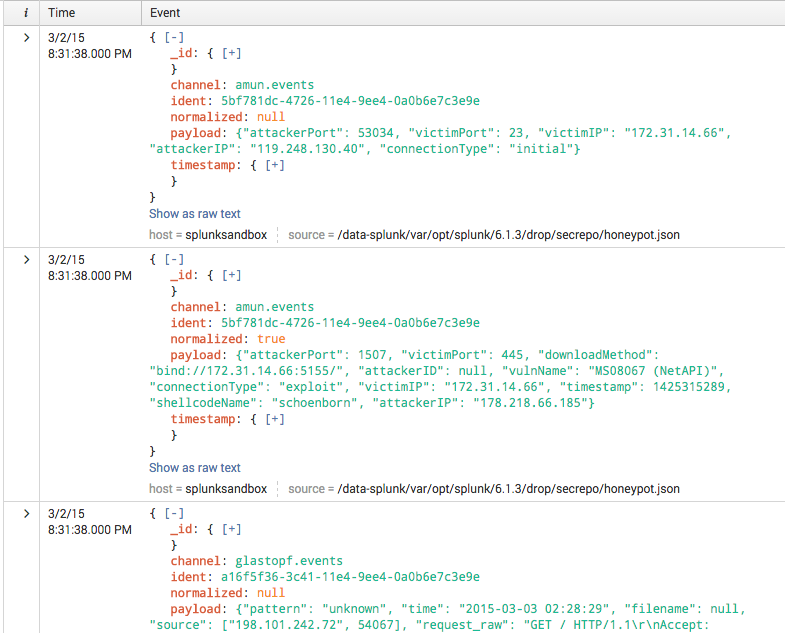
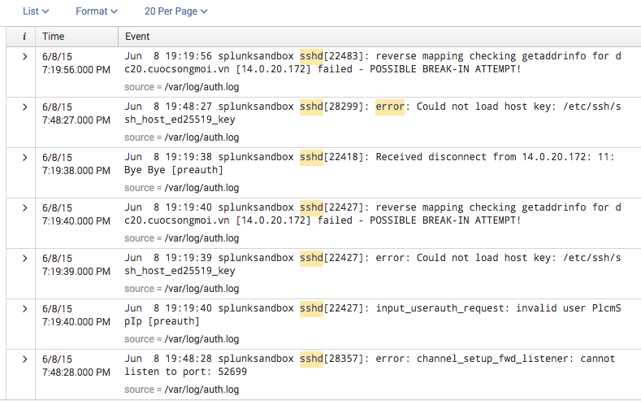

.. SplunkML Documentation file

.. _splunkml-nlcluster:

nlcluster
================================================

.. contents::
  :local:
  :backlinks: none

Synopsis
------------------------------------------------

Group similar events together. This command provides a few clustering algorithms [1]_ using Scikit-Learn [2]_, using language modelling algorithms from Gensim [3]_.


Syntax
````````````````````````````````````````````````

:: 

  nlcluster [algo=mean_shift | affinity_propagation | dbscan] [model=lsi | tfidf] <field-list>


Arguments
````````````````````````````````````````````````

field-list
  **Syntax**: ``<string>, ...``

  **Default**: ``_raw``

  **Description**: 

algo
  **Syntax**: ``mean_shift | affinity_propagation | dbscan`` 

  **Default**: ``mean_shift``

  **Description**: The algorithm to use for clustering depending on your use case.  The default Mean Shift algorithm works well for different types of log data [4]_ [5]_. Mean Shift aims to discover blobs in a smooth density of samples and is guaranteed to converge. Also available are Affinity Propagation [6]_ and DBSCAN [7]_ [8]_. Affinity Propagation determines clusters by propogating messages between samples until convergence; this results in a high complexity algorithm that works better with small to medium sized datasets. DBSCAN can handle unevenly sized clusters within a large sample set; however, it is nondeterministic and empirically we have not found it to cluster log data as well as Mean Shift.


model
  **Syntax**: ``lsi | tfidf``

  **Default**: ``lsi``

  **Description**: The semantic model to use for measuring similarity between events. This field only applies when using string fields, where the text of the fields is converted to a vector. The default model is Latent Semantic Indexing (LSI) [9]_. Alternatively, you can use the TF-IDF model [10]_. Using LSI, cosine similarity tends to be more accurate than TF-IDF models, although the TF-IDF model may perform faster and use less memory. LSI also provides an "online training" facility (ability to continuously train a pre-existing model), that while this implementation does not currently take advantage may be able to do so in the future.


Description
------------------------------------------------

Use the ``nlcluster`` command to find common or rare events/field values within a window of data.  For example, you can use this command to group similar log events and find common errors in log output.  You can sort the output by the ``cluster_size`` field in order to find the most common lines or rare (anomalous) lines. 

The ``nlcluster`` command uses a semantic model to create similarity comparisons for string data, in the form of vectors, which can be passed to a clustering algorithm. If using numeric data, the vector will be formed from each of the numeric field values specified in ``<field-list>``.

 
Examples
------------------------------------------------


**Example 1**: Using honeypot data from SecRepo [11]_, find the most common attack payloads. You can download the json dataset `here <http://www.secrepo.com/honeypot/honeypot.json.zip>`_::

  index=sample source="*honeypot.json*" | nlcluster payload | sort -cluster_size

Here's a snapshot of the results:



If we expand the first event, you can see the ``cluster_size`` and ``cluster_label`` fields: 

.. image:: nlcluster_example1b.png
   :height: 300px
   :alt: "expanded view of honeypot payload cluster event"


**Example 2**: Cluster common events in SSH ``auth.log`` entries, and sort by ``cluster_size`` to find potential outliers::
  
  index=os source="*auth.log*" earliest=-1h "sshd" | nlcluster model=tfidf | sort cluster_size

Here's a snapshot of the results:




References
------------------------------------------------

.. [1] Clustering, Scikit-learn, `<http://scikit-learn.org/stable/modules/clustering.html>`_

.. [2] Scikit-learn: Machine Learning in Python, Pedregosa et al., JMLR 12, pp. 2825-2830, 2011, `<http://jmlr.csail.mit.edu/papers/v12/pedregosa11a.html>`_

.. [3] Gensim: Topic Modelling for Humans, `<https://radimrehurek.com/gensim/>`_

.. [4] Mean Shift, Scikit-learn, `<http://scikit-learn.org/stable/modules/generated/sklearn.cluster.mean_shift.html>`_

.. [5] Mean Shift: A Robust Approach toward Feature Space Analysis, D. Comaniciu & P. Meer, IEEE Transactions on Pattern Analysis and Machine Intelligence, 2002, `<http://citeseerx.ist.psu.edu/viewdoc/download?doi=10.1.1.76.8968&rep=rep1&type=pdf>`_

.. [6] Affinity Propagation, Scikit-learn, `<http://scikit-learn.org/stable/modules/generated/sklearn.cluster.affinity_propagation.html>`_

.. [7] DBSCAN, Scikit-learn, `<http://scikit-learn.org/stable/modules/generated/sklearn.cluster.dbscan.html>`_

.. [8] A Density-Based Algorithm for Discovering Clusters in Large Spatial Databases with Noise, Ester, M., H. P. Kriegel, J. Sander, and X. Xu, In Proceedings of the 2nd International Conference on Knowledge Discovery and Data Mining, Portland, OR, AAAI Press, pp. 226–231. 1996

.. [9] LSI (Latent Semantic Indexing) Model, Gensim, `<https://radimrehurek.com/gensim/models/lsimodel.html>`_

.. [10] TF-IDF (Term Frequency - Inverse Document Frequency) Model, Gensim, `<https://radimrehurek.com/gensim/models/tfidfmodel.html>`_

.. [11] Security Repo, Mike Sconzo, `<http://www.secrepo.com>`_
