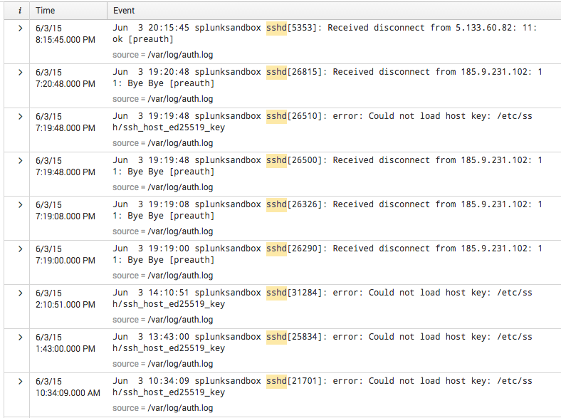
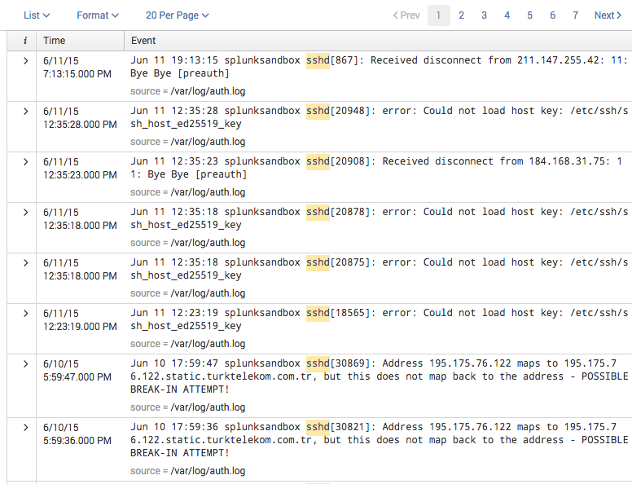
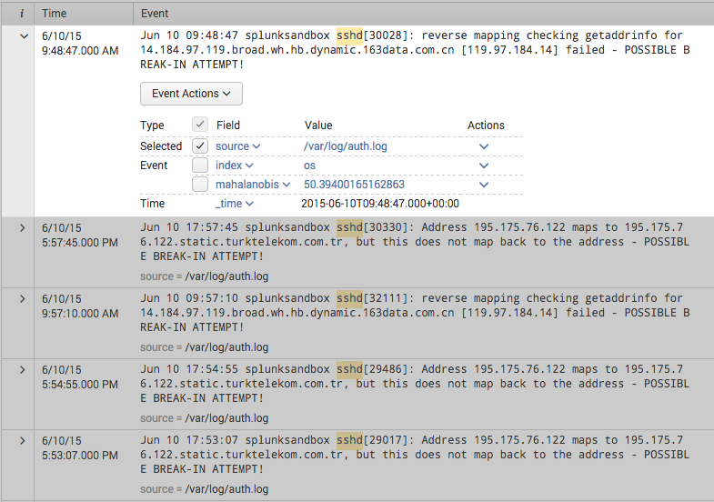

.. SplunkML Documentation file

.. _splunkml-outliers:

outliers
================================================

Contents
------------------------------------------------

.. contents::


Synopsis
------------------------------------------------

Find events or field values that are unusual within a window of data.  This command provides 2 algorithms from Scikit-Learn [1]_, *One-Class SVM* and *Robust Covariance Estimator* [2]_.


Syntax
````````````````````````````````````````````````

::

  outliers [classifier=one_class_svm | covariance_estimator] [threshold=<num>] <one-class-svm-opt>* <covariance-estimator-opt>* <field-list>


Arguments
````````````````````````````````````````````````

classifier
  **Syntax**: ``one_class_svm | covariance_estimator``

  **Default**: ``one_class_svm``

  **Description**: Choose the appropriate classifier in order to find outliers in the event stream.  The One-Class SVM classifier is the default, as it handles most cases and is useful for multi-modal distributions of data.  The Robust Covariance Estimator method works best for Gaussian distributions. 

threshold
  **Syntax**: ``<num>``

  **Default**: ``0.01``

  **Description**: A number that represents the expected fraction of events that are outliers.

field-list
  **Syntax**: ``<string>, ...``

  **Default**: ``_raw``

  **Description**: One field or a list of field names to construct feature vectors. If the fields are numeric, the numbers define a vector for the outlier calculation. If the fields are not numeric, the command will convert the concatenated text of fields to a vector using the "hashing" trick [3]_, and find outliers using the resulting vectors. The default is to convert the text in the ``_raw`` event field into a vector.

one-class-svm-opt
  **Syntax**: ``[kernel=rbf | linear | poly | sigmoid] [degree=<num>] [gamma=<num>] [coef0=<num>]``

  **Description**: These options customize the use of the One-Class SVM classifier [4]_.  They are not required, but you can use them to change most aspects of the classifier.

covariance-estimator-opt
  **Syntax**: ``[contamination=<num>] [support_fraction=<num>]``

  **Description**: These options customize the use of the Robust Covariance Estimator classifier [5]_.  They are not required, but you can use them to change most aspects of the classifier.


One-Class SVM Options
````````````````````````````````````````````````

kernel
  **Syntax**: ``rbf | linear | poly | sigmoid``

  **Default**: ``rbf``

  **Description**: Specifies the kernel type to be used in the algorithm.  

degree
  **Syntax**: ``<num>``

  **Default**: ``3``

  **Description**: Degree of the polynomial kernal function (``poly``).  Ignored for other kernels.

gamma
  **Syntax**: ``<num>``

  **Default**: ``0.1``

  **Description**: Kernel coefficient for ``rbf``, ``poly``, and ``sigmoid``.  If gamma is 0.0 then ``1/n_features`` will be used instead. (TODO: why is default 0.1 instead of 0.0 as it is in scikit? Also, would be nice to have some explanation of n_features in the 0.0 case)

coef0
  **Syntax**: ``<num>``

  **Default**: ``0.0``

  **Description**: Independent term in kernel function. It is only significant for ``poly`` and ``sigmoid`` kernel functions.


Robust Covariance Estimator Options
````````````````````````````````````````````````

support_fraction
  **Syntax**: ``<num>``

  **Description**: The proportion of points to be included in the support of the raw MCD (Minimum Covariance Determinant) estimate [6]_. If not specified, will use a minimum value of ``[n_sample + n_features + 1] / 2`` [5]_.

showmah
  **Syntax**: ``<bool>``

  **Description**: When ``showmah=true``, return the computed Mahalanobis distance [7]_ for each outlier event returned from this command. This provides a quantative sense of how strong of an outlier the specific event is based on the number of standard deviatations from the mean.


Description
------------------------------------------------

The ``outliers`` command provides 2 different methods of outlier detection when the rate of contamination (outliers) is known, or can be estimated.  

The Robust Covariance Estimator assumes a Gaussian distribution of data, and performs well for those cases.  The One-Class SVM method performs well when the data is strongly non-Gaussian (i.e. bimodal with 2 well separated clusters).


Examples
------------------------------------------------

**Example 1**: Find outlier lines in your system's ``auth.log`` from ``sshd`` over the last 15 days using default One-Class SVM::

  index=os source="*auth.log*" earliest=-15d "sshd" | outliers

Here is a snapshot of results:




**Example 2**: Find outlier lines in your system's ``auth.log`` over the last 15 days using Robust Covariance::

  index=os source="*auth.log*" earliest=-15d "sshd" | outliers classifier="covariance_estimator"

Here is a snapshot of results:



**Example 3**: Same example as before, but sort by Mahalanobis distance to surface the most unexpected outlier::

  index=os source="*auth.log*" earliest=-15d "sshd" | outliers classifier="covariance_estimator" | sort -mahalanobis

Here is a snapshot of results, with the first event expanded to show the ``mahalanobis`` field:




References
------------------------------------------------

.. [1] Scikit-learn: Machine Learning in Python, Pedregosa et al., JMLR 12, pp. 2825-2830, 2011, `<http://jmlr.csail.mit.edu/papers/v12/pedregosa11a.html>`_

.. [2] Novelty and Outlier Detection, Scikit-Learn `<http://scikit-learn.org/stable/modules/outlier_detection.html>`_

.. [3] Feature Hashing for Large Scale Multitask Learning, Kilian Weinberger; Anirban Dasgupta; John Langford; Alex Smola; Josh Attenberg, 2009, `<http://alex.smola.org/papers/2009/Weinbergeretal09.pdf>`_

.. [4] One-Class SVM, Scikit-learn, `<http://scikit-learn.org/stable/modules/generated/sklearn.svm.OneClassSVM.html>`_

.. [5] Elliptical Envelope, Scikit-learn, `<http://scikit-learn.org/stable/modules/generated/sklearn.covariance.EllipticEnvelope.html>`_

.. [6] A Fast Algorithm for the Minimum Covariance Determinant Estimator, `<http://www.geo.upm.es/postgrado/CarlosLopez/papers/FastAlgMCD99.pdf>`_

.. [7] Mahalanobis distance, Wikipedia, `<http://en.wikipedia.org/wiki/Mahalanobis_distance>`_